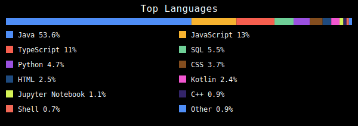

## Hi!

I'm a software engineer with wide a wide-ranging toolkit, focused on building reliable applications.

## 🚀 My Tech Stack

### 🧠 Languages

     

    

  

### 🔌 APIs

   

### 🎨 Frontend

    

### 🧪 Testing

    

### 🧰 Backend

   

### 🗄️ Databases

  

### 🛠️ Other Competences

     

## 🗣️ Languages Spoken

  &nbsp; Bulgarian 
 
  &nbsp; English 
 
  &nbsp; French 

